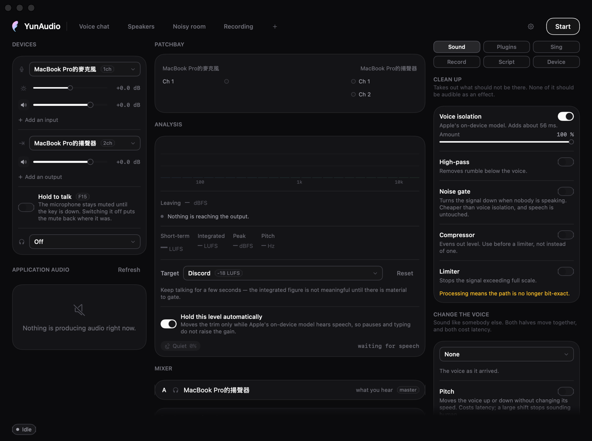

<div align="center">

# YunAudio

**An audio router for macOS with its own virtual device, and a signal path that
can be proved bit-exact.**

[](#requirements)
[](https://swift.org)
[](LICENSE)
[](#verification)
[](#requirements)

English · [繁體中文](README.zh-Hant.md) · [简体中文](README.zh-Hans.md)

</div>



## Overview

YunAudio routes a microphone, and any application's audio, into a virtual device
that other applications open as an ordinary input. It ships that virtual device
itself rather than depending on a third-party loopback driver, which is what
makes the rest of the design possible.

The original problem was narrow. Discord's WebRTC engine reaches down to the HAL
and contends with USB microphones for control of the device, producing a periodic
crackle; routing the microphone through a virtual device that Discord opens
instead removes the contention. Several macOS capabilities encountered along the
way are not exposed by anything else in this category, and the project grew to
cover them.

| | |
|---|---|
| **Platform** | macOS 26 or later |
| **Dependencies** | None. `Package.swift` declares an empty `dependencies` array |
| **Interfaces** | Window, menu bar panel, URL scheme, CLI, Unix socket, MCP, MIDI, resident JavaScript |
| **Formats** | 44.1–192 kHz; WAV, FLAC and AAC, with per-source stems |
| **Licence** | Apache 2.0 |

## Features

### Signal integrity

The virtual device derives its sample clock from the microphone being captured,
through `GetZeroTimeStamp()`. Both devices then advance together, the HAL's drift
correction can be disabled, and no stage of the path resamples. A third-party
loopback device cannot do this, having no knowledge of which input matters.

`yunaudio-cli selftest` sends a 24-bit pseudorandom sequence through the whole
path, reads it back from the loopback, recovers the delay from the data and
compares every sample:

```
bit-exact: 261400/261400 samples identical, delay 872 frames
clock lock held at 0.999986 throughout
```

The same check is available in Preferences → Diagnostics. On a path that is not
clock-locked it reports the actual condition — resampled, with the recovered
delay and the magnitude of the conversion — rather than a pass or a failure. The
`0.999986` is the microphone's crystal error: 14 ppm slow, or 50 ms of drift per
hour uncorrected.

The interface states the condition of the path at all times: bit-exact,
resampled or processed, with measured round-trip latency and the state of the
clock lock. Enabling voice isolation withdraws the bit-exactness claim, because
processing the signal contradicts it.

Method, and the limits of what it proves: **[MEASUREMENT.md](MEASUREMENT.md)**.

### Metering and analysis

Loudness is measured to ITU-R BS.1770-4 — K-weighting, 400 ms blocks at 75 %
overlap, and the two-pass gate that excludes pauses — and reported as momentary,
short-term and integrated values with the distance from a chosen platform target.
Discord normalises to approximately −18 LUFS, YouTube to −14, broadcast to −23.

The arithmetic is verified against the standard rather than against itself: a
1 kHz sine reads its own RMS level in LUFS, doubling the amplitude adds 6.02,
readings agree at 48 and 96 kHz, and silence between passages does not depress
the integrated figure.

The spectrum is twenty-four log-spaced bands with a frequency axis, calibrated so
that a tone of known amplitude returns at its own level in decibels. The
equaliser's bands sit at the frequencies the analyser draws.

### Sources and mixing

Each captured application receives its own process tap rather than joining a
shared mixdown, so gain, role and ducking behaviour are independent per source.
Multiple hardware inputs are supported on the same terms, each with its own strip.

Two independent mixes are maintained — the send and the monitor — with a
per-source level on each, and per-bus tone control and headphone correction.
Additional outputs carry a copy of the send at a level of their own.

Automatic levelling moves the input trim only while Apple's on-device sound
classifier reports speech, at 1.5 dB/s within a dead zone and bounded to 15 dB,
so pauses and typing do not raise the gain. The same classifier gates ducking, so
a cough does not attenuate music.

### Voice processing

A chain of gate, high-pass, compressor, limiter, six-band equaliser, pitch,
formant and character stages, alongside Apple's `AUSoundIsolation` — the model
behind FaceTime's Voice Isolation, measured here at 56 ms of added latency.

Pitch and formants shift independently. The spectral envelope is estimated from
the low-quefrency part of the log spectrum, stretched along the frequency axis and
divided back out, leaving the harmonics in place. Presets are verified by
measurement: a synthetic male voice through the higher-voice preset emerges with
its pitch raised by the stated 500 cents and its spectral centroid raised with it.

Third-party Audio Units are inserted after the application's own stages and before
the limiter. A unit that fails to load is reported with the step that refused it;
one requiring out-of-process hosting is identified before it enters the path,
because every render then becomes an XPC round trip.

### Karaoke


A stage of its own, alongside the panel in the main window. Both are built from
the same controls — the transport, the queue, the words controls, the scoring
switch and the key suggestion are one construction each, so a control added to
either reaches both. Only the arrangement differs.

Lyrics resolve from Music's own metadata and local `.lrc` files first, then from
LRCLIB, QQ Music, NetEase Cloud Music and lyrics.ovh, queried concurrently. A
validated timeline wins and cancels the outstanding requests. Traditional and
Simplified metadata, live editions and television-performance labels are matched
without attaching an original recording to an accompaniment. When nothing
matches, the words can be searched for by title, chosen from a file, or driven
by hand against another application's playback.

Words are swept a syllable at a time where the source carries word timing, with
pronunciation above the line and conversion between the two Chinese scripts. The
offset is remembered per song, for the files that carry no lead-in.

Scoring declares its reference: an exact melody from a matching MIDI file, an
audio-derived reference from captured original vocals, or key and timing alone
where only an accompaniment is available. The performance is aligned against the
reference with banded dynamic time warping before it is measured, so a phrase
sung late scores as late rather than as out of tune, and lateness and steadiness
are reported separately from pitch. A small on-device model on the Neural Engine
picks the voice out when the accompaniment is louder than it — worth 3, 6 and 13
points at one and a half, two and three times the singer's level, and switchable
because it cannot help below that. Each microphone keeps its own pitch history
and score.

A queue, because a machine nobody has to walk back to between songs is the point:
songs go on the end, 插播 goes next, the end stops rather than starting the
evening again. The system's own transport — the media keys, Control Centre, a
pair of AirPods — drives it.

### Recording and transcription

WAV, FLAC or AAC, with an optional file per source taken before the fader.
Transcription runs on-device through `SpeechTranscriber`, one instance per source,
so the speaker label follows the routing rather than an inference from the audio.

### Automation

| Interface | Purpose |
|---|---|
| URL scheme | Shortcuts, Stream Deck, Keyboard Maestro, `open` |
| `yunaudio-cli` | The same verbs with a reply, and the verification harness |
| Unix socket, `chmod 600` | The transport beneath the CLI and the MCP server |
| `yunaudio-mcp` | Model Context Protocol server; JSON-RPC 2.0 over stdio |
| Resident JavaScript | Handlers for mute, recording, and device arrival and departure |
| obs-websocket v5 | Mute mirroring, and the sync offset OBS cannot compute itself |
| CoreMIDI | Physical faders, with soft takeover |

One vocabulary underlies all of them, defined once in `Sources/YunAudioControl`.
Reference: **[docs/automation.md](docs/automation.md)**.

### Performance

A bare stereo route costs 0.42 % of one core and 7.1 MB resident, measured over
six minutes by `yunaudio-cli soak` with no interface attached. The application
itself is a different figure and a larger one: with a route running and the
window open it measures around 18 % of one core and 180 MB. That gap is being
worked on, and quoting only the first number would misrepresent it. Zero allocations on the IO thread, asserted in
release builds by a hook in front of every allocation the process makes. The
single exception is stated rather than hidden: Apple's voice isolation model
allocates approximately 0.3 times per cycle internally.

Twenty-one capabilities are documented in full, each with its measurement, in
**[docs/features.md](docs/features.md)**.

## Interface

<table>
<tr>
<td width="33%" valign="top"><br><b>Sound</b><br>Clean-up, voice change, tone and space, grouped by purpose rather than by position in the signal.</td>
<td width="33%" valign="top"><br><b>Sing</b><br>Timed lyrics from five sources, key detection with a suggested transpose, and a score per microphone.</td>
<td width="33%" valign="top"><br><b>Record</b><br>WAV, FLAC or AAC, with a file per source alongside the mix.</td>
</tr>
<tr>
<td valign="top"><br><b>Plug-ins</b><br>Third-party Audio Units, with load failures reported by cause.</td>
<td valign="top"><br><b>Script</b><br>Resident JavaScript, with handlers for the router's own events.</td>
<td valign="top"><br><b>Device</b><br>Setups, per-bus tone, headphone correction, output alignment and the light ring.</td>
</tr>
</table>

<table>
<tr>
<td width="30%" valign="top"><br><b>Menu bar panel</b><br>The controls a session needs, without the window.</td>
<td width="70%" valign="top">
<br>
<b>Diagnostics.</b> The integrity check runs from the interface as well as the
command line. It sends the 24-bit sequence through the configured path, reads it
back from the loopback, recovers the delay from the data and compares every
sample, reporting the condition of the path rather than a verdict.
</td>
</tr>
</table>

## Requirements

- **macOS 26 or later.** Live transcription requires macOS 27; on 26 it is
  reported as unavailable with the reason, and the remaining features are
  unaffected.
- **An Xcode carrying the macOS 27 SDK** to build, because live transcription
  uses `AnalyzerInputConverter`. The build scripts locate one; a hand-run
  `swift build` needs `source ./App/toolchain.sh` first, otherwise the error is
  `cannot find type 'AnalyzerInputConverter' in scope`.
- **No third-party dependencies.**

## Installation

### Disk image

`./package.sh` produces `build/YunAudio-<version>.dmg`, containing the
application, the virtual device, and a script each to install and remove it.

The application is ad-hoc signed, so macOS refuses the first launch and reports
that the developer cannot be verified. Privacy & Security in System Settings
offers **Open Anyway**; once is sufficient. `READ ME FIRST.txt` in the image
states this, and the steps involved.

### From source

A locally built binary carries no quarantine attribute, so the first-launch
dialog does not apply.

```bash
# The virtual device. Installation restarts coreaudiod, briefly stopping all
# system audio, and requires an administrator password.
./Driver/build-driver.sh --install

# The application.
./App/build-app.sh --run
```

Removal:

```bash
sudo rm -rf /Library/Audio/Plug-Ins/HAL/YunAudioDriver.driver
sudo killall coreaudiod
```

### The virtual device is optional

Application capture, the processing chain, recording, transcription, monitoring,
OBS integration, MIDI and scripting require nothing to be installed. The device
provides the remaining capability: other applications selecting YunAudio as their
input, over a bit-exact path.

## Verification

```bash
./App/verify.sh --list                        # the steps, with their cost
./App/verify.sh                               # everything not requiring audio hardware
./App/verify.sh --full                        # and the flow check, which takes the hardware
./App/verify.sh --fresh                       # and a clean clone built from nothing
./App/verify.sh --only=build,tests            # 10 s
./App/verify.sh --flow="more than one input"  # one flow-check section, 44 s
```

The steps are independent by design: 2022 unit tests, a string-table comparison
across three languages, an offscreen render of every panel, a photograph of the
window as the window server drew it, an assertion that no other instance holds
the audio devices, a release-build bit-exactness measurement, and a flow check
driving the whole interface against live hardware.

A run that skips a step reports it, and a narrowed run lists everything it did
not cover, so a ten-second run cannot be mistaken for a complete one.

Photographs are written to `build/screenshots`. The gate can establish that a
photograph was taken; it cannot establish that the layout in it is correct.

Each step, and each probe beneath it — the soak test, the echo-cancellation seam,
the far-end ring — is documented in
**[docs/verification.md](docs/verification.md)**.

## Project layout

```
Sources/
  YunAudioRT/       C shim for os_workgroup and the allocation tripwire, both
                    unavailable from Swift
  YunAudioHAL/      device enumeration, aggregate devices, process taps,
                    stream formats, clock analysis
  YunAudioEngine/   the IOProc, routing matrix, clock anchor publisher,
                    voice isolation, self test
  YunDesign/        the design system, as SwiftUI
  YunAudioControl/  the command vocabulary and the control socket, shared by the
                    application, the command line and the MCP server
  YunAudioApp/      the application
  yunaudio-cli/     the verification harness, and the command line
  yunaudio-mcp/     the MCP server
Driver/             YunAudioDriver.driver, an AudioServerPlugIn
App/                bundle assembly, the icon, and verify.sh
```

## Limitations

- **Issue #9 remains open.** A previous session left
  `coreaudiod` and the system Sound menu degraded after YunAudio had exited.
  Version 0.1.2 removes measured driver, teardown and ownership defects which
  made that class of failure more likely, but the isolated system-audio recovery
  validation in [issue #9](https://github.com/YuhuanStudio/YunAudio/issues/9)
  is still incomplete. Keep the removal command available when using the optional driver.
- The driver is ad-hoc signed. Distribution without a first-launch dialog
  requires a Developer ID identity and notarisation.
- Voice isolation causes `AudioUnitRender` to allocate on the IO thread, at
  approximately 0.3 allocations per cycle, from within Apple's model. The bypass
  path remains at zero. No dropout has been observed, but the realtime contract
  is broken while it is enabled.
- A driver fault takes `coreaudiod` down with all attached system audio. The
  removal command above is worth keeping to hand.
- The virtual device's input level control is implemented but verified only by
  inspection; it has not been moved through System Settings on-device, because
  installing a driver restarts `coreaudiod`.
- Echo cancellation costs the clock lock and bit-exactness, and adds a buffer of
  latency in each direction. This is structural rather than a defect: the
  canceller must own the microphone and the speaker together, so the microphone
  leaves the router's aggregate and the clock master becomes the destination. It
  is disabled by default, and the interface states the cost before it is enabled.

Full list, including approaches that were measured and rejected:
**[docs/limits.md](docs/limits.md)**.

## Documentation

An index in all three languages: **[docs/](docs/README.md)**.

| | |
|---|---|
| [MEASUREMENT.md](MEASUREMENT.md) | The bit-exactness method, and the limits of what it proves |
| [docs/verification.md](docs/verification.md) | The gate, every probe beneath it, and their blind spots |
| [docs/features.md](docs/features.md) | All twenty-one capabilities, with measurements |
| [docs/automation.md](docs/automation.md) | CLI, control socket, MCP, scripting, OBS, MIDI |
| [docs/hardware.md](docs/hardware.md) | Razer HID control, and how the protocol was established |
| [docs/limits.md](docs/limits.md) | What does not work, and what was rejected |
| [DEVICES.md](DEVICES.md) | Per-device hardware facts, and how each was verified |
| [AGENTS.md](AGENTS.md) | The working agreement for changes to this project |

## Licence

Apache 2.0. See [LICENSE](LICENSE) and [NOTICE](NOTICE).

## Contributing

**[CONTRIBUTING.md](CONTRIBUTING.md)** is how to build it, what a change needs
before it can be merged, and the two operations that require a human.
**[AGENTS.md](AGENTS.md)** is the longer working agreement behind it: the
invariants, why the four interface checks are each blind to what the others
catch, and the approaches already measured and rejected.

Security reports go through **[SECURITY.md](SECURITY.md)** rather than a public
issue — the virtual device is loaded into `coreaudiod` and carries every other
application's audio.
