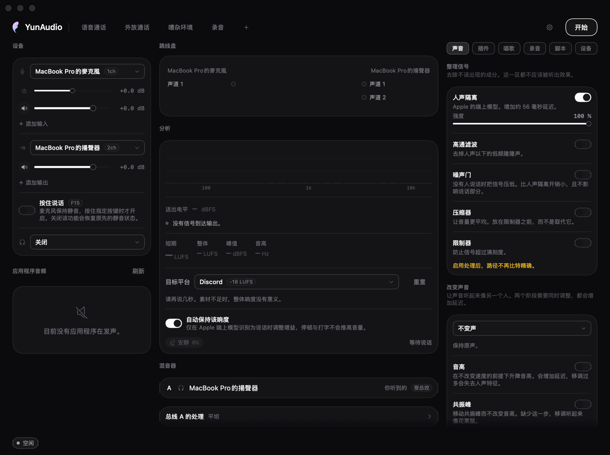

<div align="center">

# YunAudio

**macOS 音频路由器，自带虚拟设备，信号路径的比特精确可被证明。**

[](#系统需求)
[](https://swift.org)
[](LICENSE)
[](#验证)
[](https://sparkle-project.org)

[English](README.md) · [繁體中文](README.zh-Hant.md) · 简体中文

</div>



## 概览

YunAudio 把麦克风，以及任何应用程序的音频，路由进一个虚拟设备，让其他应用程序作为普通
输入打开。该虚拟设备由本项目自行实现，不依赖第三方 loopback 驱动 —— 那是其余设计得以
成立的前提。

最初的问题范围很窄：Discord 的 WebRTC 引擎会下探到 HAL 层，与 USB 麦克风争夺设备控制权，
造成周期性爆音；改由“Discord 打开的虚拟设备”承接麦克风即可消除这一竞争。开发过程中遇到
的若干 macOS 能力在同类软件中无人公开，项目范围因此扩大。

| | |
|---|---|
| **平台** | macOS 15 或更高 |
| **依赖** | Sparkle 2，嵌入 app 以提供已签名的更新 |
| **接口** | 窗口、菜单栏面板、URL scheme、CLI、Unix socket、MCP、MIDI、常驻 JavaScript |
| **格式** | 44.1–192 kHz；WAV、FLAC、AAC，支持每来源分轨 |
| **许可** | Apache 2.0 |

## 功能

### 信号完整性

虚拟设备通过 `GetZeroTimeStamp()`，把采样时钟推导自正在被捕获的那支麦克风。两个设备
因此同步前进，HAL 的漂移校正可以关闭，路径上没有任何一级重采样。第三方 loopback 设备
做不到这件事 —— 它无从得知哪一个输入才是关键。

`yunaudio-cli selftest` 送一段 24 比特的伪随机序列走完整条路径，从 loopback 读回，
从数据中还原延迟，并逐个比对每个采样：

```
bit-exact: 261400/261400 samples identical, delay 872 frames
clock lock held at 0.999986 throughout
```

同一检查也在“设置 → 诊断”中提供。在未取得时钟锁定的路径上，它报告的是实际状态 ——
已重采样，附还原出的延迟与转换幅度 —— 而非通过或失败。`0.999986` 是该麦克风的晶振误差：
慢 14 ppm，未经校正时等于每小时 50 毫秒的漂移。

界面随时陈述路径状态：比特精确、已重采样或已处理，并附实测往返延迟与时钟锁定的现状。
启用人声隔离会撤回比特精确的声明，因为处理信号与之相斥。

方法及其证明范围：**[MEASUREMENT.md](MEASUREMENT.md)**。

### 测量与分析

响度依 ITU-R BS.1770-4 测量 —— K 加权、400 毫秒块、75 % 重叠，以及排除停顿的两段式
门 —— 并以瞬时、短期与整体三个数值报告，同时给出与所选平台目标的差距。Discord 归一化
至约 −18 LUFS、YouTube −14、广播 −23。

算术是对照标准验证，而非对照自身：1 kHz 正弦波读出的 LUFS 等于其 RMS 电平、振幅加倍
增加 6.02、48 kHz 与 96 kHz 下读数一致，且段落间的静音不会压低整体值。

频谱为二十四个对数间隔频段，附频率轴并经校准 —— 已知振幅的音频会以其自身分贝值返回。
均衡器的频段落在分析器所绘制的频率上。

### 来源与混音

每个被捕获的应用程序拥有各自的 process tap，而非并入共用降混，因此增益、角色与闪避行为
均可独立设定。多个硬件输入以同样方式支持，各自拥有一条通道。

系统维持两份独立混音 —— 发送与监听 —— 每份各有每来源的发送量，并各自拥有总线音色调整
与耳机补偿。额外输出承载发送混音的副本，并具备独立音量。

自动调平仅在 Apple 端上声音分类器判定为说话时移动输入电平，速率 1.5 dB/s、设有死区、
上限 15 dB，因此停顿与键盘声不会推高增益。同一分类器亦作为闪避的判断依据，咳嗽不会
压低音乐。

### 人声处理

处理链包含噪声门、高通、压缩器、限制器、六段均衡器，以及音高、共振峰与音色阶段，另有
Apple 的 `AUSoundIsolation` —— FaceTime“人声隔离”背后的模型，本项目实测其增加 56 毫秒
延迟。

音高与共振峰独立位移。频谱包络自对数频谱的低 quefrency 部分估出，沿频率轴拉伸后除回，
使谐波保持原位。预设经测量验证：合成男声通过“变高”预设后，音高上升所述的 500 音分，
频谱重心同步上升。

第三方 Audio Unit 插入于本应用程序所有处理阶段之后、限制器之前。加载失败的单元会连同
拒绝它的步骤一并报告；需要跨进程宿主的单元会在进入路径前被标示，因为此时每一次 render
都成为一次 XPC 往返。

### 唱歌


有自己的舞台，也在主窗口里有一份。两边由同一批组件构成 —— 播放条、点歌单、歌词控制、
评分开关与移调建议各只有一份构造，所以其中一边加了控件，另一边同时就有。不同的只有排版。

歌词优先取自 Music 自身的元数据与本地 `.lrc`，其次并行查询 LRCLIB、QQ 音乐、网易云音乐
与 lyrics.ovh。通过校验的时间轴胜出，并取消其余请求。繁简元数据、现场版与电视演出标记
均会比对，不会将原唱错误地对应到伴奏。全部落空时，可以用歌名搜索、直接选文件，
或对着别的播放器手动跑词。

来源带有逐字时间时，歌词逐字扫过；上方可显示拼音，并可在繁简之间转换。偏移量会逐首记住 ——
给那些没有前奏留白的文件。

评分会声明其参考来源：同名 MIDI 文件提供精确旋律；已捕获的原唱提供从音频推导的参考；
仅有伴奏时则只提供调性与时值。测量之前会先用带状动态时间规整把演唱与参考对齐，因此晚进的
乐句算成「晚了」而不是「走音」，迟滞与稳定度也与音准分开报告。伴奏比人声大时，Neural Engine
上的小模型会把人声挑出来 —— 在 1.5、2、3 倍时分别值 3、6、13 分，低于此无用，所以可以关掉。
每支麦克风保有各自的音高历史与分数。

点歌单：加在最后，插播排到下一首，唱完就停而不是从头再来一轮。系统本身的播放控制 ——
媒体键、控制中心、AirPods 上的按钮 —— 都能操作它。

### 录音与转录

支持 WAV、FLAC 与 AAC，并可选择为每个来源各写一个文件，取自推子之前。转录通过
`SpeechTranscriber` 在本机执行，每个来源一个实例，因此说话人标签依循路由而非从音频推断。

### 自动化

| 接口 | 用途 |
|---|---|
| URL scheme | 快捷指令、Stream Deck、Keyboard Maestro、`open` |
| `yunaudio-cli` | 同一组动词，但有响应；同时是验收工具 |
| Unix socket，`chmod 600` | CLI 与 MCP 服务器底层的传输 |
| `yunaudio-mcp` | Model Context Protocol 服务器；stdio 上的 JSON-RPC 2.0 |
| 常驻 JavaScript | 静音、录音、设备出现与移除的处理器 |
| obs-websocket v5 | 静音同步，以及 OBS 自身无法计算的同步偏移 |
| CoreMIDI | 实体推子，带 soft takeover |

以上共用同一套词汇，在 `Sources/YunAudioControl` 中定义一次。
参考：**[docs/automation.md](docs/automation.md)**。

### 性能

裸路由占用单核心 0.42 %、常驻 7.1 MB —— 那是以 `yunaudio-cli soak` 在没有界面的
情况下测量六分钟的结果。**应用程序本身是另一个、而且更大的数字**：路由运行中、窗口
打开时实测约为单核心 18 %、180 MB。这个差距正在处理中；只引用前一个数字会造成误导。

IO 线程零分配，
于 release 构建中由拦在每一次分配之前的钩子断言。唯一的例外予以明示而非隐藏：Apple 的
人声隔离模型内部每周期约分配 0.3 次。

二十一项能力的完整记载，每项均附测量：**[docs/features.md](docs/features.md)**。

## 界面

<table>
<tr>
<td width="33%" valign="top"><br><b>声音</b><br>整理信号、改变声音、音色与空间，按用途而非按信号位置分组。</td>
<td width="33%" valign="top"><br><b>唱歌</b><br>五个来源的同步歌词、调性识别与建议移调，以及每支麦克风各自的分数。</td>
<td width="33%" valign="top"><br><b>录音</b><br>WAV、FLAC 或 AAC，并在混音之外为每个来源各写一个文件。</td>
</tr>
<tr>
<td valign="top"><br><b>插件</b><br>第三方 Audio Unit，加载失败按原因报告。</td>
<td valign="top"><br><b>脚本</b><br>常驻 JavaScript，可注册路由器自身事件的处理器。</td>
<td valign="top"><br><b>设备</b><br>设置组、总线音色、耳机补偿、输出对齐与灯环。</td>
</tr>
</table>

<table>
<tr>
<td width="30%" valign="top"><br><b>菜单栏面板</b><br>一次会话所需的控件，无需打开窗口。</td>
<td width="70%" valign="top">
<br>
<b>诊断。</b>完整性检查可由界面执行，不限于命令行。它把 24 比特序列送过当前配置的路径，
从 loopback 读回，从数据中还原延迟并逐个比对每个采样，报告路径状态而非判定结果。
</td>
</tr>
</table>

## 系统需求

- **macOS 14.2 或更高。** 下限是 process tap；人声隔离需要 macOS 15，实时转录需要
  macOS 26，把捕获保持在应用程序关闭后也是。需要较新系统的功能会说明原因而不是消失；
  路由、捕获、效果与 KTV 从 14.2 起均可使用。
- **构建需要带 macOS 27 SDK 的 Xcode**，因为实时转录使用 `AnalyzerInputConverter`。
  构建脚本会自行查找；手动执行 `swift build` 需先 `source ./App/toolchain.sh`，否则
  报错为 `cannot find type 'AnalyzerInputConverter' in scope`。
- **Sparkle 2 是唯一第三方依赖。** 它嵌入 app，并使用 YunAudio 的 Ed25519 密钥验证
  更新 feed 与每一份 archive。

## 安装

### Homebrew

```bash
brew install --cask yuhuanstudio/tap/yunaudio
```

之后可用 `brew upgrade --cask yunaudio` 升级。Homebrew 只会把 app 放进“应用程序”；
不会安装可选的音频设备、不会请求管理员权限，也不会重启系统音频。

### 磁盘映像

`./package.sh` 生成 `build/YunAudio-<版本>.dmg`，内含应用程序、虚拟设备，以及安装与
卸载各一个脚本。

应用程序为 ad-hoc 签名，因此 macOS 会拒绝首次启动并报告无法验证开发者。系统设置的
“隐私与安全性”提供**仍要打开**，执行一次即可。映像内的 `READ ME FIRST.txt` 说明这件事
与相关步骤。

从“应用程序”启动后，YunAudio 会通过 Sparkle 检查已签名的更新 feed，并在解压前验证更新
本身。没有付费 Apple Developer 身份时，app 被替换后 macOS 仍可能再次请求麦克风或
“自动化”权限。

### 从源码构建

本机构建的可执行文件不带隔离属性，因此不会出现首次启动对话框。

```bash
# 虚拟设备。安装会重启 coreaudiod，全系统音频短暂中断，并需要管理员密码。
./Driver/build-driver.sh --install

# 应用程序。
./App/build-app.sh --run
```

卸载：

```bash
sudo rm -rf /Library/Audio/Plug-Ins/HAL/YunAudioDriver.driver
sudo killall coreaudiod
```

### 虚拟设备为可选

捕获应用程序、处理链、录音、转录、监听、OBS 对接、MIDI 与脚本均不需安装任何东西。
虚拟设备提供的是其余那项能力：其他应用程序可将 YunAudio 选为输入，并经由比特精确的路径。

## 验证

```bash
./App/verify.sh --list                        # 各步骤与其成本
./App/verify.sh                               # 所有不需音频硬件的部分
./App/verify.sh --full                        # 加上会占用硬件的 flow check
./App/verify.sh --fresh                       # 加上从零构建的干净 clone
./App/verify.sh --only=build,tests            # 10 秒
./App/verify.sh --flow="more than one input"  # 单一 flow check 段落，44 秒
```

各步骤刻意互相独立：单元测试套件、三语言字符串表比对、每个面板的离屏渲染、窗口服务器
实际绘制之窗口的照片、“无其他实例占用音频设备”的断言、release 构建的比特精确测量，
以及一次驱动整个界面对真实硬件执行的 flow check。

跳过任何步骤的执行都会报告；缩小范围的执行会列出所有未覆盖的项目，因此一次十秒的执行
不会被误认为完整验证。

照片写入 `build/screenshots`。此关卡能确立“照片已拍摄”，但无法确立“照片中的布局正确”。

各步骤及其下每个探测工具 —— soak 测试、回声消除接缝、远端 ring —— 记载于
**[docs/verification.md](docs/verification.md)**。

## 项目结构

```
Sources/
  YunAudioRT/       os_workgroup 与分配拦截器的 C 层，两者在 Swift 中不可用
  YunAudioHAL/      设备枚举、聚合设备、process tap、流格式、时钟分析
  YunAudioEngine/   IOProc、路由矩阵、时钟锚点发布、人声隔离、自测
  YunDesign/        设计系统，以 SwiftUI 实现
  YunAudioControl/  命令词汇与控制套接字，由应用程序、命令行与 MCP 服务器共用
  YunAudioApp/      应用程序本体
  yunaudio-cli/     验收工具与命令行
  yunaudio-mcp/     MCP 服务器
Driver/             YunAudioDriver.driver，一个 AudioServerPlugIn
App/                bundle 组装、图标与 verify.sh
```

## 限制

- **issue #9 仍未关闭。** 过去一次 session 在 YunAudio 已退出后仍使 `coreaudiod` 与系统
  Sound 菜单劣化。0.1.2 已移除会提高此类故障概率的已测量 driver、teardown 与 ownership
  缺陷，但 [issue #9](https://github.com/YuhuanStudio/YunAudio/issues/9) 的隔离系统音频恢复
  验证仍未完成。使用可选驱动时，请保留卸载命令备用。
- app 与驱动均为 ad-hoc 签名。要在分发时不出现首次启动对话框，或让隐私权限跨版本保留，
  需要 Developer ID 身份与公证。Sparkle 使用 Ed25519 验证 feed 与 archive；但 ad-hoc host
  必须关闭 Library Validation，才能加载由不同签名拥有的 updater framework。
- 人声隔离会使 `AudioUnitRender` 在 IO 线程上分配内存，约每周期 0.3 次，来自 Apple
  模型内部。旁路路径保持为零。目前未观察到断音，但该功能启用期间实时契约是破的。
- 驱动故障会使 `coreaudiod` 连同所有挂载的系统音频一并终止。上述卸载命令值得留在手边。
- 虚拟设备的输入电平控制已实现，但仅以检视方式验证；尚未在真机上经由系统设置实际操作，
  因为安装驱动会重启 `coreaudiod`。
- 回声消除的代价是时钟锁定与比特精确，并在往返各增加一个缓冲区的延迟。此为结构性限制
  而非缺陷：消除器必须同时拥有麦克风与扬声器，因此麦克风离开路由器的聚合设备，时钟主控
  转为目的地。默认关闭，界面会在启用前陈述其代价。

完整清单，含已测量并排除的方案：**[docs/limits.md](docs/limits.md)**。

## 文档

三种语言的索引：**[docs/](docs/zh-Hans/README.md)**。

| | |
|---|---|
| [MEASUREMENT.md](MEASUREMENT.md) | 比特精确的测量方法，以及其证明范围 |
| [docs/verification.md](docs/verification.md) | 验收关卡、下面每个探测工具与各自的盲区 |
| [docs/features.md](docs/features.md) | 二十一项能力的完整记载，附测量 |
| [docs/automation.md](docs/automation.md) | CLI、控制套接字、MCP、脚本、OBS、MIDI |
| [docs/hardware.md](docs/hardware.md) | Razer HID 控制，以及该协议的确立过程 |
| [docs/limits.md](docs/limits.md) | 不可行的部分，以及已排除的方案 |
| [DEVICES.md](DEVICES.md) | 各设备的硬件事实，以及每项事实的核实方式 |
| [AGENTS.md](AGENTS.md) | 变更本项目的工作约定 |

## 许可

Apache 2.0。见 [LICENSE](LICENSE) 与 [NOTICE](NOTICE)。

## 参与

**[CONTRIBUTING.md](CONTRIBUTING.md)** 说明怎么构建、一个修改要有什么才能被合并，
以及那两个必须由人执行的操作。**[AGENTS.md](AGENTS.md)** 是它背后完整的工作协定：
不变条件、四种界面检查为何各自看不见对方抓到的东西，以及已测量并排除的方案。

安全性问题请走 **[SECURITY.md](SECURITY.md)**，不要开公开 issue —— 虚拟设备是载入
`coreaudiod` 的，它承载着其他每一个程序的音频。
