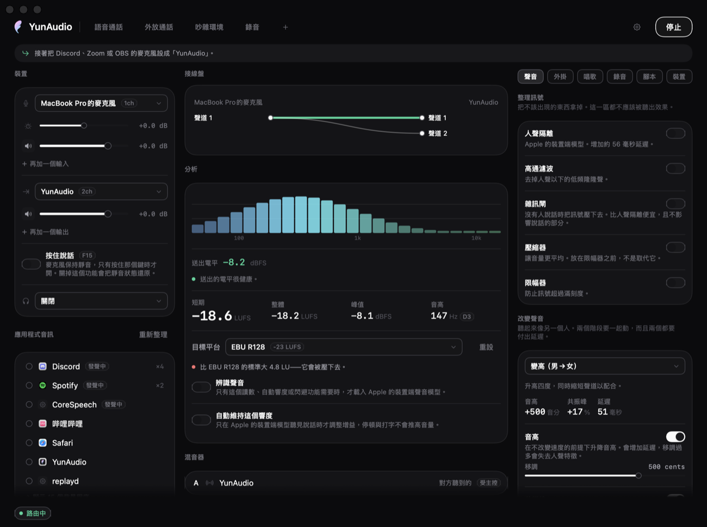
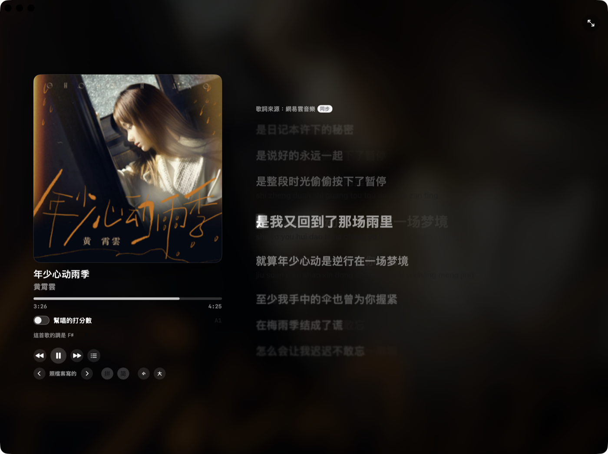
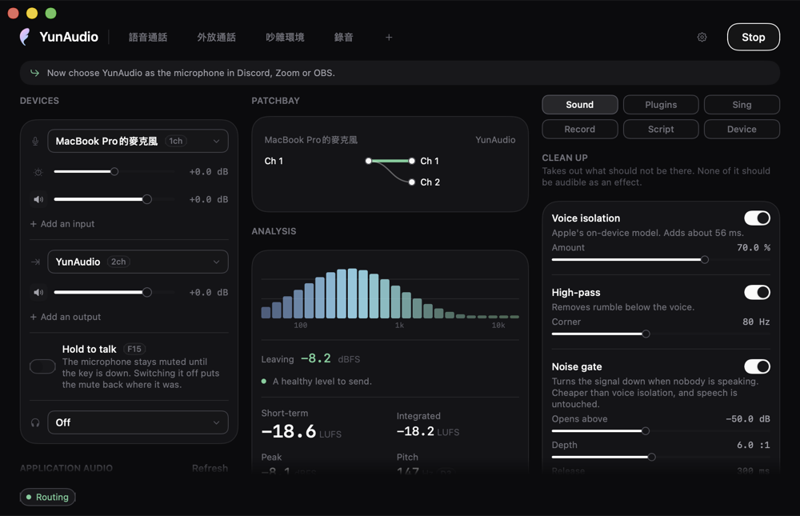
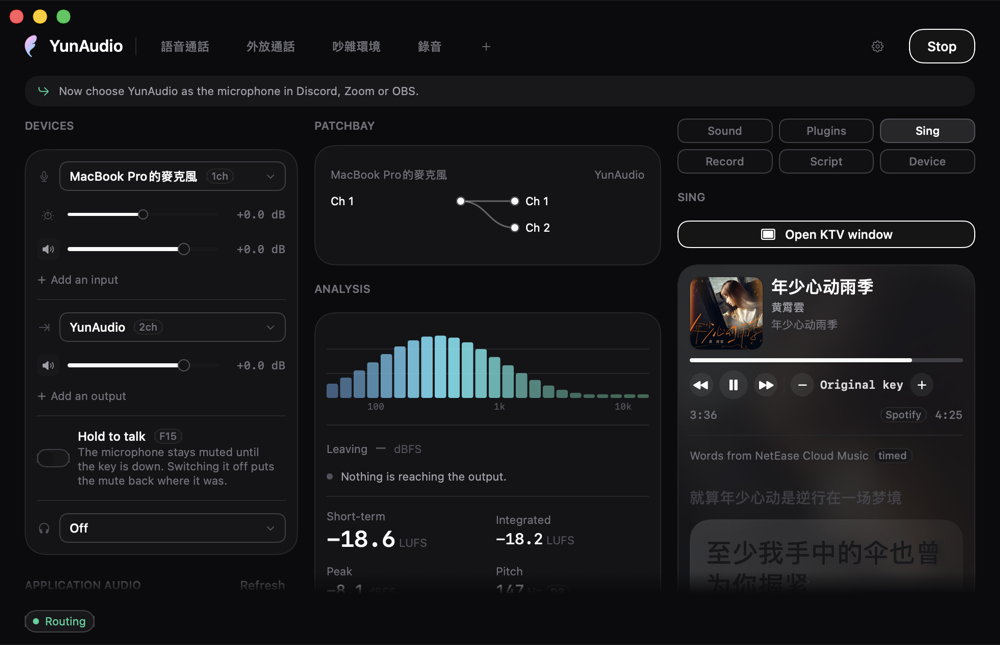
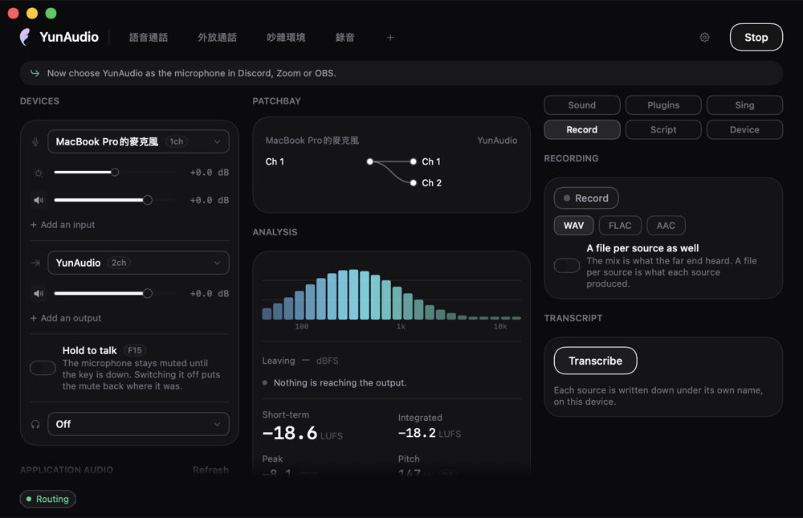
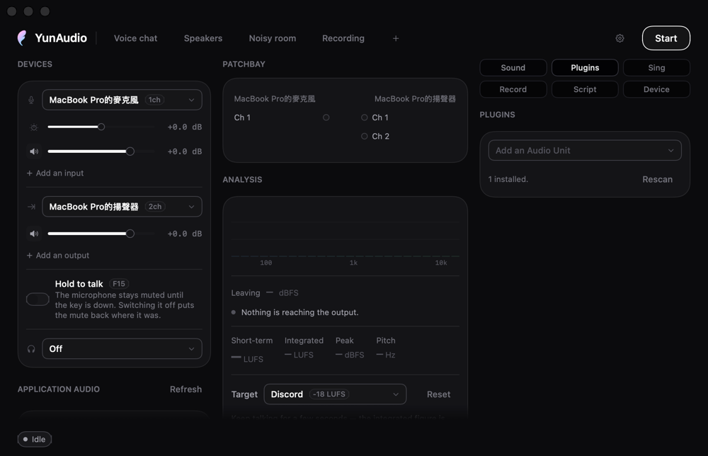
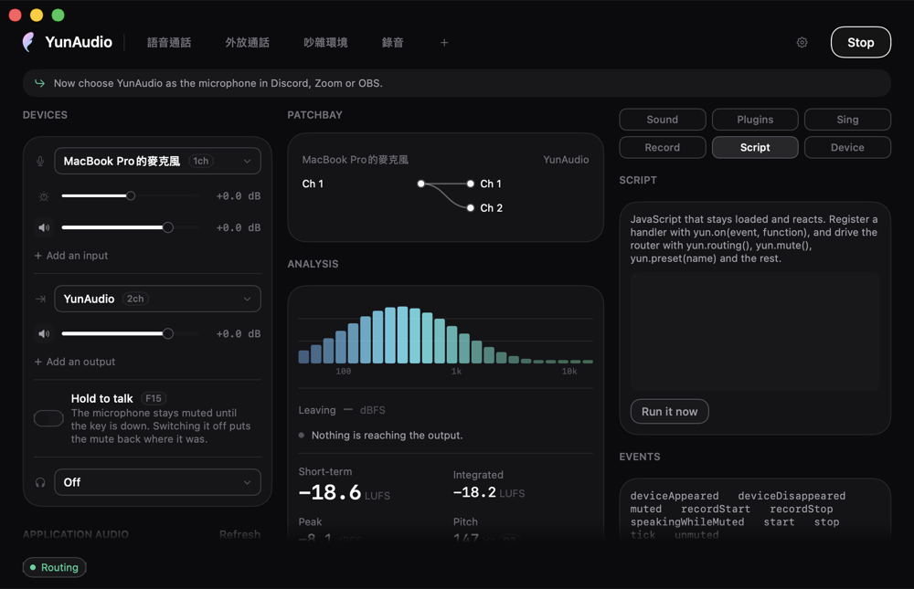
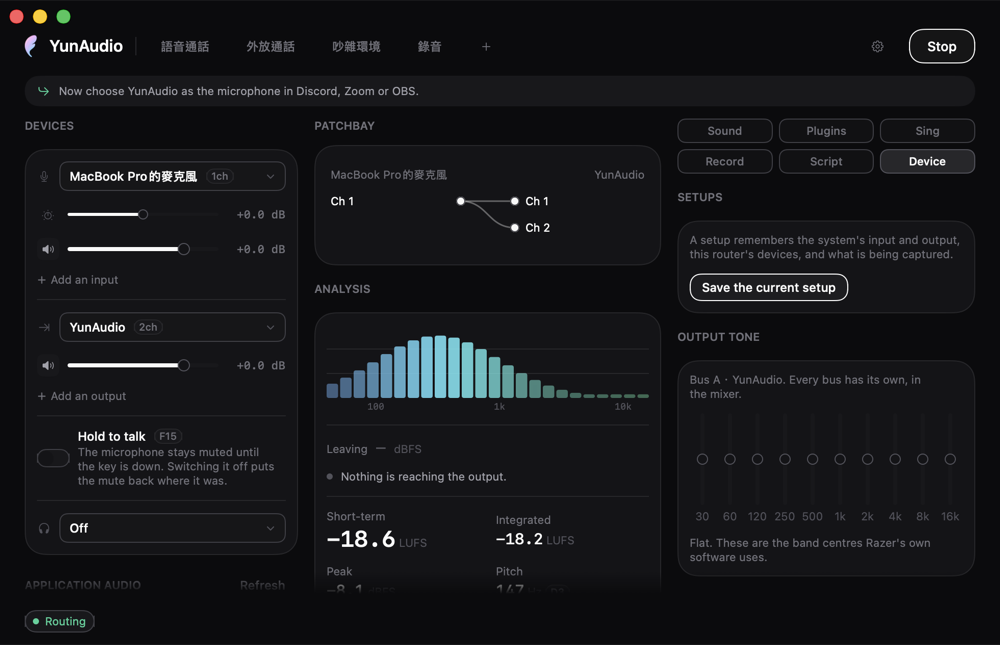
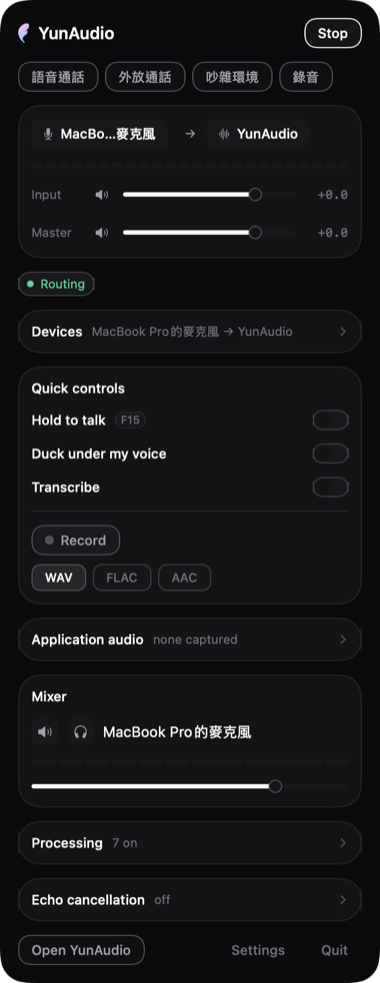
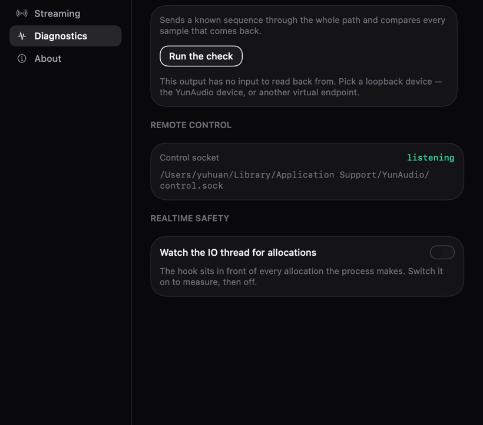

<div align="center">

# YunAudio

**macOS 音訊路由器，自帶虛擬裝置，訊號路徑的位元精確可被證明。**

[](#系統需求)
[](https://swift.org)
[](LICENSE)
[](#驗證)
[](#系統需求)

[English](README.md) · 繁體中文 · [简体中文](README.zh-Hans.md)

</div>



## 概觀

YunAudio 把麥克風、以及任何應用程式的音訊，路由進一個虛擬裝置，讓其他應用程式當成一般
輸入來開啟。該虛擬裝置由本專案自行實作，不依賴第三方 loopback 驅動 —— 那是其餘設計得以
成立的前提。

最初的問題範圍很窄：Discord 的 WebRTC 引擎會下探至 HAL 層，與 USB 麥克風爭奪裝置控制權，
造成週期性爆音；改由「Discord 所開啟的虛擬裝置」承接麥克風即可消除該競爭。開發過程中
遇到的數項 macOS 能力在同類軟體中無人公開，專案範圍因此擴大。

| | |
|---|---|
| **平台** | macOS 26 或更新 |
| **相依** | 無。`Package.swift` 的 `dependencies` 為空陣列 |
| **介面** | 視窗、選單列面板、URL scheme、CLI、Unix socket、MCP、MIDI、常駐 JavaScript |
| **格式** | 44.1–192 kHz；WAV、FLAC、AAC，支援每來源分軌 |
| **授權** | Apache 2.0 |

## 功能

### 訊號完整性

虛擬裝置透過 `GetZeroTimeStamp()`，把取樣時鐘推導自正在被擷取的那支麥克風。兩個裝置
因此同步前進，HAL 的漂移補償可以關閉，路徑上沒有任何一級重採樣。第三方 loopback 裝置
做不到這件事 —— 它無從得知哪一個輸入才是關鍵。

`yunaudio-cli selftest` 送一段 24 位元的偽隨機序列走完整條路徑，自 loopback 讀回，
從資料中還原延遲，並逐一比對每個取樣：

```
bit-exact: 261400/261400 samples identical, delay 872 frames
clock lock held at 0.999986 throughout
```

同一項檢查也在「設定 → 診斷」中提供。在未取得時鐘鎖定的路徑上，它回報的是實際狀態 ——
已重採樣，附還原出的延遲與轉換幅度 —— 而非通過或失敗。`0.999986` 是該麥克風的石英誤差：
慢 14 ppm，未經修正時等於每小時 50 毫秒的漂移。

介面隨時陳述路徑狀態：位元精確、已重採樣或已處理，並附實測來回延遲與時鐘鎖定的現況。
啟用人聲隔離會撤回位元精確的聲明，因為處理訊號與之相斥。

方法與其證明範圍：**[MEASUREMENT.md](MEASUREMENT.md)**。

### 量測與分析

響度依 ITU-R BS.1770-4 量測 —— K 加權、400 毫秒區塊、75 % 重疊，以及排除停頓的兩段式
閘門 —— 並以瞬時、短期與整體三個數值回報，同時給出與所選平台目標的差距。Discord 正規化
至約 −18 LUFS、YouTube −14、廣播 −23。

算術是對照標準驗證，而非對照自身：1 kHz 正弦波讀出的 LUFS 等於其 RMS 電平、振幅加倍
增加 6.02、48 kHz 與 96 kHz 下讀數一致，且段落間的靜音不會壓低整體值。

頻譜為二十四個對數間隔頻段，附頻率軸並經校準 —— 已知振幅的音訊會以其自身分貝值回傳。
等化器的頻段落在分析器所繪製的頻率上。

### 來源與混音

每個被擷取的應用程式擁有各自的 process tap，而非併入共用降混，因此增益、角色與閃避行為
皆可獨立設定。多個硬體輸入以同樣方式支援，各自擁有一條通道。

系統維持兩份獨立混音 —— 送出與監聽 —— 每份各有每來源的送出量，並各自擁有匯流排音色
調整與耳機補償。額外輸出承載送出混音的副本，並具備獨立音量。

自動調平僅在 Apple 裝置端聲音分類器判定為說話時移動輸入電平，速率 1.5 dB/s、設有死區、
上限 15 dB，因此停頓與打字不會推高增益。同一分類器亦作為閃避的判斷依據，咳嗽不會壓低
音樂。

### 人聲處理

處理鏈包含雜訊閘、高通、壓縮器、限幅器、六段等化器，以及音高、共振峰與音色階段，另有
Apple 的 `AUSoundIsolation` —— FaceTime「語音隔離」背後的模型，本專案實測其增加 56 毫秒
延遲。

音高與共振峰獨立位移。頻譜包絡自對數頻譜的低 quefrency 部分估出，沿頻率軸拉伸後除回，
使諧波保持原位。預設經量測驗證：合成男聲通過「變高」預設後，音高上升所述的 500 音分，
頻譜重心同步上升。

第三方 Audio Unit 插入於本應用程式所有處理階段之後、限幅器之前。載入失敗的單元會連同
拒絕它的步驟一併回報；需要跨處理程序託管的單元會在進入路徑前被標示，因為此時每一次
render 都成為一次 XPC 往返。

### 唱歌



有自己的舞台，也在主視窗裡有一份。兩邊由同一批元件組成 —— 播放列、點歌單、歌詞控制、
評分開關與移調建議各只有一份構造，所以其中一邊加了控制項，另一邊同時就有。不同的只有排版。

歌詞優先取自 Music 自身的中介資料與本機 `.lrc`，其次並行查詢 LRCLIB、QQ 音樂、
網易雲音樂與 lyrics.ovh。通過驗證的時間軸勝出，並取消其餘請求。繁簡中介資料、現場版與
電視演出標記均會比對，不會將原唱錯誤地對應到伴奏。全部落空時，可以用歌名搜尋、直接選檔，
或對著別的播放器手動跑詞。

來源帶有逐字時間時，歌詞逐字掃過；上方可顯示拼音，並可在繁簡之間轉換。偏移量會逐首記住 ——
給那些沒有前奏留白的檔案。

評分會宣告其參考來源：同名 MIDI 檔提供精確旋律；已擷取的原唱提供從音訊推導的參考；
僅有伴奏時則只提供調性與時間。量測之前會先用帶狀動態時間規整把演唱與參考對齊，因此晚進的
樂句算成「晚了」而不是「走音」，遲滯與穩定度也與音準分開報告。伴奏比人聲大時，Neural Engine
上的小模型會把人聲挑出來 —— 在 1.5、2、3 倍時分別值 3、6、13 分，低於此無用，所以可以關掉。
每支麥克風保有各自的音高歷史與分數。

點歌單：加在最後，插播排到下一首，唱完就停而不是從頭再來一輪。系統本身的播放控制 ——
媒體鍵、控制中心、AirPods 上的按鈕 —— 都能操作它。

### 錄音與轉錄

支援 WAV、FLAC 與 AAC，並可選擇為每個來源各寫一個檔案，取自推桿之前。轉錄透過
`SpeechTranscriber` 在本機執行，每個來源一個實例，因此語者標籤依循路由而非從音訊推斷。

### 自動化

| 介面 | 用途 |
|---|---|
| URL scheme | 捷徑、Stream Deck、Keyboard Maestro、`open` |
| `yunaudio-cli` | 同一組動詞，但有回應；同時是驗收工具 |
| Unix socket，`chmod 600` | CLI 與 MCP 伺服器底下的傳輸層 |
| `yunaudio-mcp` | Model Context Protocol 伺服器；stdio 上的 JSON-RPC 2.0 |
| 常駐 JavaScript | 靜音、錄音、裝置出現與移除的處理器 |
| obs-websocket v5 | 靜音同步，以及 OBS 自身無法計算的同步偏移 |
| CoreMIDI | 實體推桿，具 soft takeover |

以上共用同一套詞彙，在 `Sources/YunAudioControl` 中定義一次。
參考：**[docs/automation.md](docs/automation.md)**。

### 效能

裸路由佔用單核心 0.42 %、常駐 7.1 MB —— 那是以 `yunaudio-cli soak` 在沒有介面的
情況下量測六分鐘的結果。**應用程式本身是另一個、而且更大的數字**：路由執行中、視窗
開著時實測約為單核心 18 %、180 MB。這個差距正在處理中；只引用前一個數字會造成誤導。

IO 執行緒零配置，於 release 建置中由攔在每一次配置之前的掛勾斷言。唯一的例外予以明示而非隱藏：
Apple 的人聲隔離模型內部每週期約配置 0.3 次。

二十一項能力的完整記載，每項均附量測：**[docs/features.md](docs/features.md)**。

## 介面

<table>
<tr>
<td width="33%" valign="top"><br><b>聲音</b><br>整理訊號、改變聲音、音色與空間，依用途而非依訊號位置分組。</td>
<td width="33%" valign="top"><br><b>唱歌</b><br>五個來源的同步歌詞、調性偵測與建議移調，以及每支麥克風各自的分數。</td>
<td width="33%" valign="top"><br><b>錄音</b><br>WAV、FLAC 或 AAC，並於混音之外為每個來源各寫一個檔案。</td>
</tr>
<tr>
<td valign="top"><br><b>外掛</b><br>第三方 Audio Unit，載入失敗依原因回報。</td>
<td valign="top"><br><b>腳本</b><br>常駐 JavaScript，可註冊路由器自身事件的處理器。</td>
<td valign="top"><br><b>裝置</b><br>設定組、匯流排音色、耳機補償、輸出對齊與燈環。</td>
</tr>
</table>

<table>
<tr>
<td width="30%" valign="top"><br><b>選單列面板</b><br>一次工作階段所需的控制項，不需開啟視窗。</td>
<td width="70%" valign="top">
<br>
<b>診斷。</b>完整性檢查可由介面執行，不限於命令列。它把 24 位元序列送過目前設定的路徑，
自 loopback 讀回，從資料中還原延遲並逐一比對每個取樣，回報路徑狀態而非判定結果。
</td>
</tr>
</table>

## 系統需求

- **macOS 26 或更新。** 即時轉錄需要 macOS 27；在 26 上會標示為不可用並說明原因，其餘
  功能不受影響。
- **建置需要帶 macOS 27 SDK 的 Xcode**，因為即時轉錄使用 `AnalyzerInputConverter`。
  建置腳本會自行尋找；手動執行 `swift build` 需先 `source ./App/toolchain.sh`，否則
  錯誤訊息為 `cannot find type 'AnalyzerInputConverter' in scope`。
- **無第三方相依。**

## 安裝

### 磁碟映像

`./package.sh` 產生 `build/YunAudio-<版本>.dmg`，內含應用程式、虛擬裝置，以及安裝與
移除各一個腳本。

應用程式為 ad-hoc 簽章，因此 macOS 會拒絕首次啟動並回報無法驗證開發者。系統設定的
「隱私權與安全性」提供**仍要打開**，執行一次即可。映像內的 `READ ME FIRST.txt` 說明
這件事與相關步驟。

### 從原始碼建置

本機建置的執行檔不帶隔離屬性，因此不會出現首次啟動對話框。

```bash
# 虛擬裝置。安裝會重啟 coreaudiod，全系統音訊短暫中斷，並需要管理員密碼。
./Driver/build-driver.sh --install

# 應用程式。
./App/build-app.sh --run
```

移除：

```bash
sudo rm -rf /Library/Audio/Plug-Ins/HAL/YunAudioDriver.driver
sudo killall coreaudiod
```

### 虛擬裝置為選配

擷取應用程式、處理鏈、錄音、轉錄、監聽、OBS 對接、MIDI 與腳本皆不需安裝任何東西。
虛擬裝置提供的是其餘那項能力：其他應用程式可將 YunAudio 選為輸入，並經由位元精確的
路徑。

## 驗證

```bash
./App/verify.sh --list                        # 各步驟與其成本
./App/verify.sh                               # 所有不需音訊硬體的部分
./App/verify.sh --full                        # 加上會佔用硬體的 flow check
./App/verify.sh --fresh                       # 加上從零建置的乾淨 clone
./App/verify.sh --only=build,tests            # 10 秒
./App/verify.sh --flow="more than one input"  # 單一 flow check 段落，44 秒
```

各步驟刻意互相獨立：1379 個單元測試、三語言字串表比對、每個面板的離屏繪製、視窗伺服器
實際繪製之視窗的照片、「無其他實例佔用音訊裝置」的斷言、release 建置的位元精確量測，
以及一次驅動整個介面對真實硬體執行的 flow check。

跳過任何步驟的執行都會回報；縮小範圍的執行會列出所有未涵蓋的項目，因此一次十秒的執行
不會被誤認為完整驗證。

照片寫入 `build/screenshots`。此關卡能確立「照片已拍攝」，但無法確立「照片中的版面正確」。

各步驟與其底下每個探測工具 —— soak 測試、回音消除接縫、遠端 ring —— 記載於
**[docs/verification.md](docs/verification.md)**。

## 專案結構

```
Sources/
  YunAudioRT/       os_workgroup 與配置攔截器的 C 層，兩者在 Swift 中不可用
  YunAudioHAL/      裝置列舉、聚合裝置、process tap、串流格式、時鐘分析
  YunAudioEngine/   IOProc、路由矩陣、時鐘錨點發布、人聲隔離、自我測試
  YunDesign/        設計系統，以 SwiftUI 實作
  YunAudioControl/  指令詞彙與控制通訊端，由應用程式、命令列與 MCP 伺服器共用
  YunAudioApp/      應用程式本體
  yunaudio-cli/     驗收工具與命令列
  yunaudio-mcp/     MCP 伺服器
Driver/             YunAudioDriver.driver，一個 AudioServerPlugIn
App/                bundle 組裝、圖示與 verify.sh
```

## 限制

- 驅動為 ad-hoc 簽章。要在散布時不出現首次啟動對話框，需要 Developer ID 身分與公證。
- 人聲隔離會使 `AudioUnitRender` 在 IO 執行緒上配置記憶體，約每週期 0.3 次，來自 Apple
  模型內部。旁路路徑維持為零。目前未觀察到斷音，但該功能啟用期間即時契約是破的。
- 驅動故障會使 `coreaudiod` 連同所有掛載的系統音訊一併中止。上述移除指令值得留在手邊。
- 虛擬裝置的輸入電平控制已實作，但僅以檢視方式驗證；尚未在真機上經由系統設定實際操作，
  因為安裝驅動會重啟 `coreaudiod`。
- 回音消除的代價是時鐘鎖定與位元精確，並在來回各增加一個緩衝區的延遲。此為結構性限制
  而非缺陷：消除器必須同時擁有麥克風與喇叭，因此麥克風離開路由器的聚合裝置，時鐘主控
  轉為目的地。預設關閉，介面會在啟用前陳述其代價。

完整清單，含已量測並排除的方案：**[docs/limits.md](docs/limits.md)**。

## 文件

三種語言的索引：**[docs/](docs/zh-Hant/README.md)**。

| | |
|---|---|
| [MEASUREMENT.md](MEASUREMENT.md) | 位元精確的量測方法，以及其證明範圍 |
| [docs/verification.md](docs/verification.md) | 驗收關卡、底下每個探測工具與各自的盲點 |
| [docs/features.md](docs/features.md) | 二十一項能力的完整記載，附量測 |
| [docs/automation.md](docs/automation.md) | CLI、控制通訊端、MCP、腳本、OBS、MIDI |
| [docs/hardware.md](docs/hardware.md) | Razer HID 控制，以及該協定的確立過程 |
| [docs/limits.md](docs/limits.md) | 不可行的部分，以及已排除的方案 |
| [DEVICES.md](DEVICES.md) | 各裝置的硬體事實，以及每項事實的查證方式 |
| [AGENTS.md](AGENTS.md) | 變更本專案的工作協定 |
| [TODO.md](TODO.md) | 計畫中的工作，附各項的支持證據 |
| [RESEARCH.md](RESEARCH.md) | 決策背後的競品與 API 研究 |

## 授權

Apache 2.0。見 [LICENSE](LICENSE) 與 [NOTICE](NOTICE)。

選它而非 MIT 是為了專利授權：貢獻者連同程式碼一起授予其專利主張，而任何人
拿專利提告就失去這份授權。其餘權限與 MIT 相同 —— 隨你使用、修改，包進閉源
產品也可以。

## 參與

**[AGENTS.md](AGENTS.md)** 是工作協定：不變條件、需要人工執行的操作、四種介面檢查的
差異，以及已量測並排除的方案。

```bash
swift build && swift test
"$(xcrun --find swift-format)" lint --recursive Sources Tests
"$(xcrun --find swift-format)" format --in-place --recursive Sources Tests
```

`swift-format` 位於 Xcode 工具鏈而不在 `PATH` 上，因此透過 `xcrun` 呼叫。
